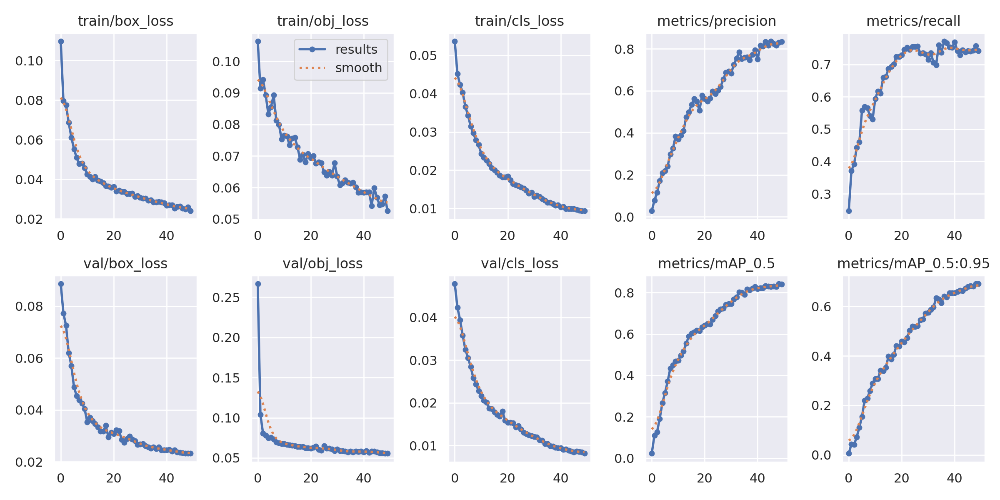
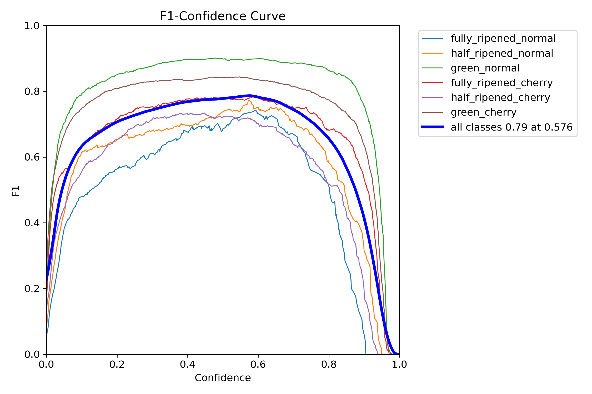
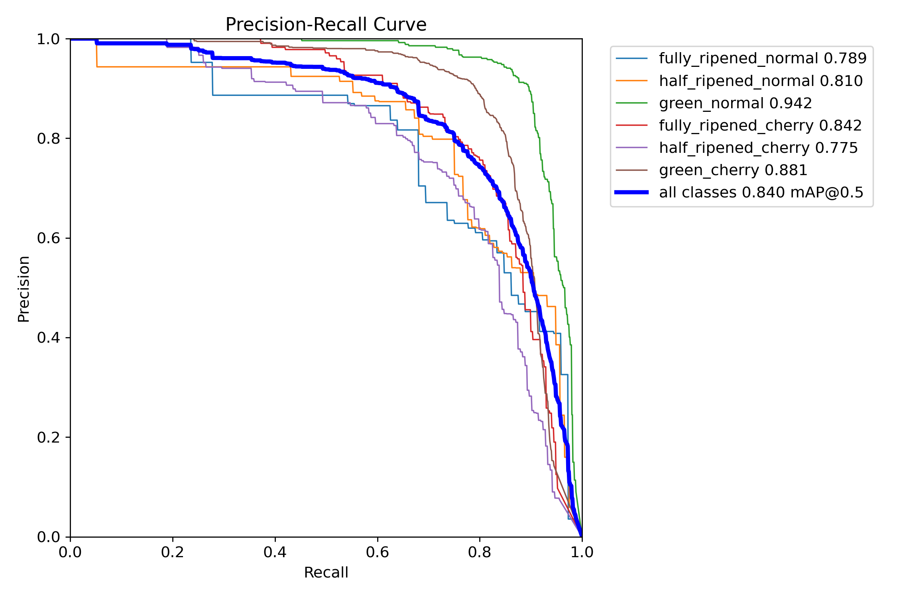
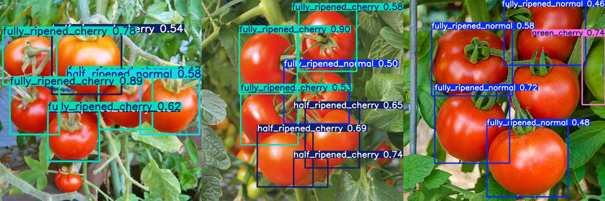
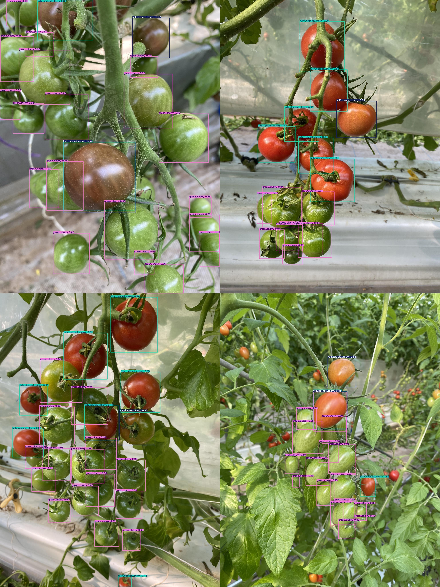
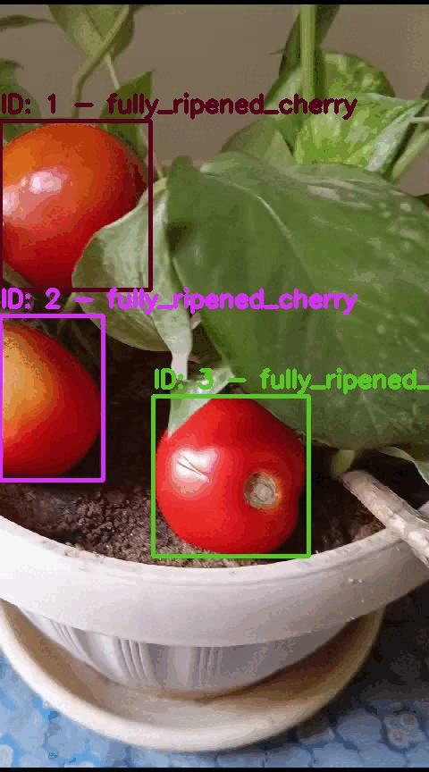

# Tomato Detection, Counting, and Tracking with YOLO

## Project Overview

This project aims to create a robust and efficient model for detecting, counting, and tracking tomatoes using the YOLO (You Only Look Once) object detection algorithm. The model is trained on a dataset containing various stages of tomato ripeness and size classes, allowing it to accurately identify and categorize tomatoes in different conditions.

## Dataset

The dataset used in this project is based on the [Laboro Tomato Dataset](https://github.com/laboroai/LaboroTomato), which includes annotations for:

- **Tomato Size**: 
  - Normal
  - Cherry

- **Ripeness Stages**:
  - Fully Ripened
  - Half Ripened
  - Green

Each tomato is categorized based on these attributes, allowing the model to distinguish between different tomato types and ripeness stages. To convert the dataset annotations to YOLO format and organize the images, run  data_conversion.py script

## Installing DeepSort

To enable tracking in the project, we use DeepSort, a popular tracking algorithm. You can install it using the following commands:

```bash
git clone https://github.com/nwojke/deep_sort.git
cd deep_sort
pip install -r requirements.txt

```

## Project Structure

The project is organized as follows:

```
Tomato_Detection_Counting_Tracking_yolo/
├── yolov5/                   # YOLOv5 framework
│   ├── runs/
│   │   └── train/
│   │       └── exp/
│   │           └── weights/
│   │               ├── best.pt
│   │               └── last.pt
│   ├── tracker.py
│   ├── train.py
│   ├── utils/
│   ├── val.py
│   ├── yolov5m.pt
│   └── yolov5s.pt
├── scripts/                   # YOLOv5 framework
│   ├── detect_n_count_n_track.py
│   ├── detect_n_count.py
│   └── detect.py
├── data.yaml                 # Configuration file for the dataset
├── data_conversion.py        # Script for converting annotations to YOLO format
├── images/
│   ├── train/                # Training images
│   └── test/                 # Test images
├── labels/
│   ├── train/                
│   └── test/                 
├── laboro_tomato/            # Original dataset
│   ├── annotations/
│   │   ├── test.json
│   │   └── train.json
│   ├── test/
│   └── train/
├── testing_images/
│   ├── test_consective/
│   └── test_general/
├── save_results/
│   ├── exp/
│   └── exp2/
└── README.md                 
```

## Training the Model

To train the model, use the following command:

```bash
python yolov5/train.py --img 640 --batch 16 --epochs 50 --data /path/to/data.yaml --weights yolov5s.pt --cache
```

This command trains the YOLOv5 model using the specified dataset, batch size, and number of epochs. The trained model weights will be saved in the `runs/train/exp/weights/` directory.

## Testing the Model

To test the model on custom images, use the following command:

```bash
python yolov5/detect.py --weights /path/to/weights/best.pt --source /path/to/testing_images/ --save-txt --save-conf --project /path/to/save_results/
```

This command runs the YOLOv5 model on the specified images and saves the detection results in the `save_results` directory.


## How to Run the Scripts

This project includes different scripts for various tasks like detection, counting, and tracking. Here’s when and how to run each:

| Script Name                   | Description                                                                 | When to Run                                                      | Command Example                                                                 |
|-------------------------------|-----------------------------------------------------------------------------|------------------------------------------------------------------|---------------------------------------------------------------------------------|
| `detect.py`                   | Runs YOLOv5 model on custom images and saves detection results.             | After training the model or for simple detection without counting.| `python yolov5/detect.py --weights /path/to/weights/best.pt --source /path/to/testing_images/ --save-txt --save-conf --project /path/to/save_results/` |
| `detect_n_count.py`           | Detects tomatoes and counts them without tracking across frames.            | Use this for counting tomatoes in single images or non-sequential image sets. | `python yolov5/detect_n_count.py --weights /path/to/weights/best.pt --source /path/to/testing_images/ --save-txt --save-conf --project /path/to/save_results/` |
| `detect_n_count_n_track.py`   | Detects, counts, and tracks tomatoes across consecutive frames.             | Use this when tracking tomatoes across video frames or sequential images is required. | `python yolov5/detect_n_count_n_track.py --weights /path/to/weights/best.pt --source /path/to/testing_images/ --save-txt --save-conf --project /path/to/save_results/` |

## Results

The model was trained for 50 epochs, achieving the following metrics:

- **Precision (P)**: 83.8%
- **Recall (R)**: 74.2%
- **mAP@50**: 84.0%
- **mAP@50-95**: 69.1%

The model exhibits significant improvements across all key metrics, showing a well-trained and robust performance. Training losses decreased by approximately 80%, while validation losses dropped by 75%. Precision improved to 75%, and recall reached 70%, demonstrating the model's increasing accuracy in detecting relevant objects and capturing all relevant instances.

- **Box Loss**: Starting around 0.08, decreased to approximately 0.02, indicating good generalization, with a similar trend in training box loss.
- **Objectness Loss**: Declined from around 0.25 to 0.05, reflecting the model's ability to maintain detection confidence on unseen data.
- **Classification Loss**: Fell from about 0.04 to 0.01, showing the model’s increasing accuracy in classifying new data.

- **mAP@0.5**: Climbed from 0.3 to 0.7, indicating strong performance in overall detection accuracy at a lower IoU threshold.
- **mAP@0.5:0.95**: Rose from around 0.1 to 0.6, demonstrating the model's consistent improvement in precision and recall even at stricter IoU thresholds, further highlighting its robustness.

Overall, these results confirm that the model generalizes effectively, making it suitable for practical applications in tomato detection, counting, and tracking tasks.


The F1-Confidence Curve and Precision-Recall Curve provide key insights into the model's performance. The F1 score peaks at **0.79** at a confidence threshold of **0.576**, indicating a strong balance between precision and recall. The Precision-Recall Curve reveals a **mAP@0.5** of **0.840**, showing high accuracy in detection, especially for the green_normal class with a precision of **0.942**. However, classes like fully_ripened_normal and half_ripened_cherry perform slightly lower, indicating areas for improvement. Overall, the model demonstrates robust performance, suitable for practical tomato detection and tracking applications.
<p align="center">
  
  
</p>

## Testing Results

After training, the model was tested on various custom images and sequences to evaluate its performance in real-world scenarios. The following results were observed:

- **Detection Accuracy**: The model successfully detected and categorized tomatoes with high accuracy, even in challenging conditions such as overlapping fruits or varying lighting.
  
    
    

- **Tracking Stability**: The `detect_n_count_n_track.py` script demonstrated effective tracking across video frames, maintaining accurate count and identity of tomatoes across consecutive frames. The DeepSort integration proved essential in handling occlusions and re-identifying tomatoes.

    

## GitHub Repository

This project is hosted on GitHub. You can clone the repository using the following command:

```bash
git clone https://github.com/NadaAbbas444/Tomato_Detection_Counting_Tracking_yolo.git
```


## Acknowledgements

This project leverages the YOLOv5 implementation by [Ultralytics](https://github.com/ultralytics/yolov5) and the Laboro Tomato Dataset. Special thanks to the contributors of these resources for their invaluable tools and data.

## Contact

If you have any questions, suggestions, or issues, please feel free to contact me at [n.elsayed@nu.edu.eg](mailto:n.elsayed@nu.edu.eg).
